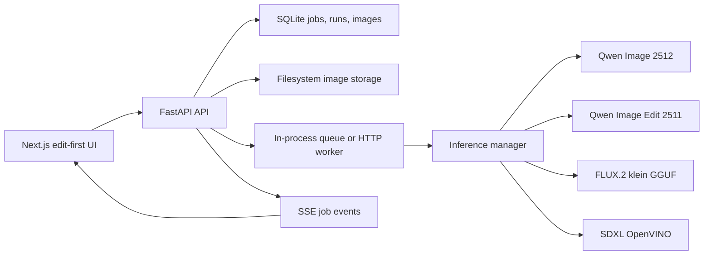
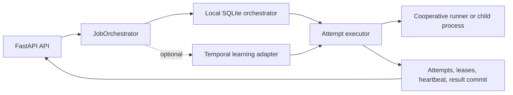

# System Overview

Status: Active
Last updated: 2026-07-16
Owner: Tech Lead

## Purpose

AI Image Edit is a local, offline-after-setup Windows application with an edit-first browser UI, a Python API,
SQLite metadata, filesystem image storage, and interchangeable model runners.

## Current Topology

## Current Product Surface

- `/chat` is the primary product route
- the UI exposes explicit `Edit Photo` and `Create from Scratch` modes
- editing supports one base image and one optional reference image
- successful outputs support compare, download, history, and reuse
- manual-review lanes stop at `pending_review` until explicit reveal
- `/arena` remains a secondary diagnostics surface

## Current Execution Modes

- `local`: an in-process queue and worker threads execute jobs inside the API process
- `worker`: the API dispatches a persisted job id to a separate HTTP worker and receives event callbacks

Both modes use the same job/run/image API model. Neither currently supplies durable attempt leases or mid-run
recovery.

## Target Reliability Topology

This target is incremental. The existing API and model runners remain stable while orchestration and attempt
execution are separated.

## Evidence Environments

- current Windows workstation: development and fast checks
- Windows Sandbox: clean-Windows installation surrogate
- Docker/WSL2: reproducible non-model build/test lane
- off-box stronger hardware: optional model acceptance lane

## Known Gaps

- queued/running jobs are marked failed after backend restart
- cancellation and retry are not durable product commands
- EventSource transport loss is not cleanly separated from job failure in the frontend
- Python dependency resolution is open-ended
- frontend product workflows lack automated browser tests
- local Qwen Edit acceptance is blocked by a native CPU crash

## Related Docs

- `docs/architecture/backend-architecture.md`
- `docs/architecture/frontend-architecture.md`
- `docs/architecture/job-and-data-flow.md`
- `docs/models/model-catalog.md`
- `docs/adr/0005-cpu-first-product-and-validation-strategy.md`
- `docs/adr/0006-durable-job-orchestration.md`
