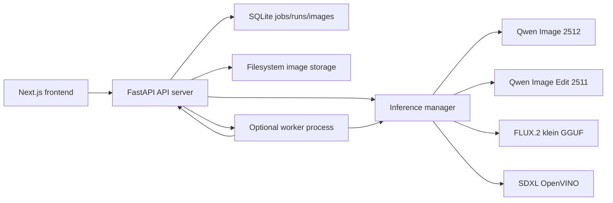

# System Overview

## Purpose

This repository is a local, offline-after-setup AI image generation and editing system with a web frontend and a Python backend. The product direction is edit-first, but the current implementation still exposes both generation and editing through a shared shell.

## Topology

## Current system shape

- Frontend: Next.js App Router app under `frontend/app/`
- API: FastAPI service under `backend/app/`
- Optional worker: `backend/worker/main.py`
- Persistence: SQLite plus filesystem image storage under `data/`
- Inference lanes: registered in `backend/inference/manager.py`

## Current product shape

- The public roadmap is edit-first.
- The visible implementation is still centered on a shared chat shell rather than explicit edit-first modes.
- History, replay, image upload, and generated-image reuse are already implemented and provide the bridge into the intended editor workflow.

## Operational modes

- `local`: API process also executes inference
- `worker`: API dispatches jobs to a separate worker process

Both modes share the same job table and API contract.

## Major known gaps

- Job execution is not durable across restart; queued and running jobs are marked failed.
- The frontend shell still needs clearer explicit create vs edit workflow framing.
- Model lifecycle is split across the registry, runner manager, env docs, and mirror scripts.

## Documentation map

- Backend details: `docs/architecture/backend-architecture.md`
- Frontend details: `docs/architecture/frontend-architecture.md`
- Job and data flow: `docs/architecture/job-and-data-flow.md`
- Model catalog: `docs/models/model-catalog.md`
